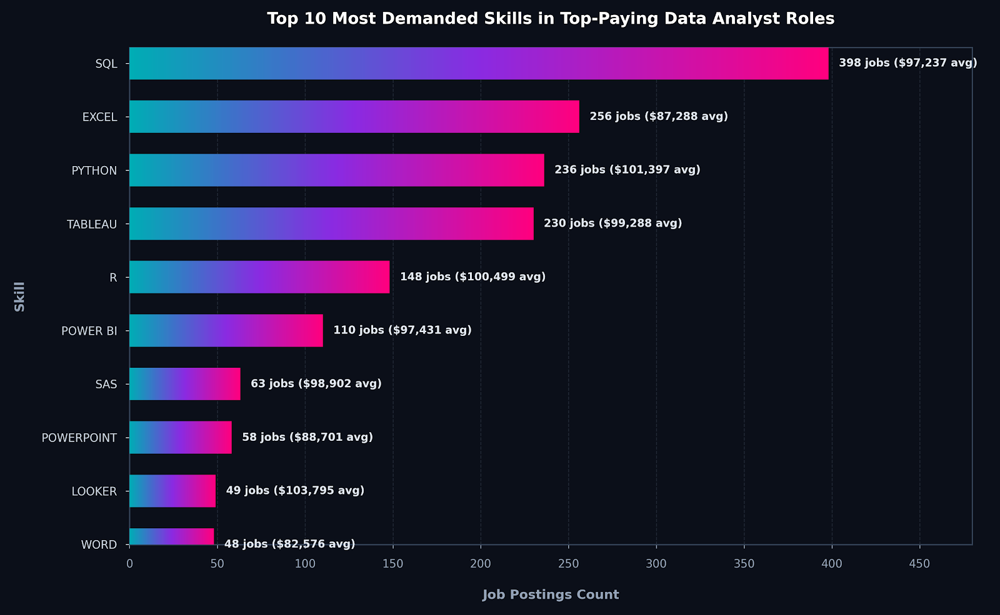
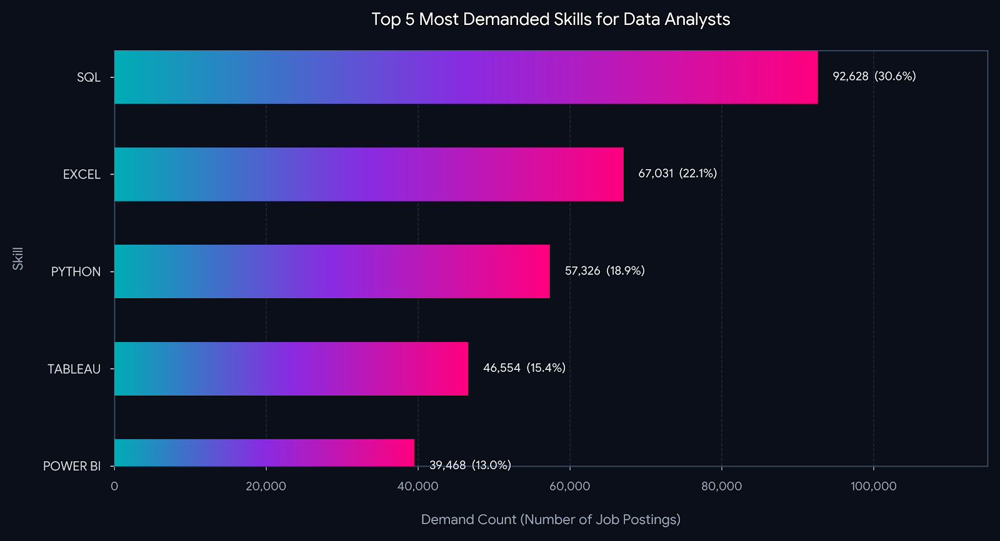
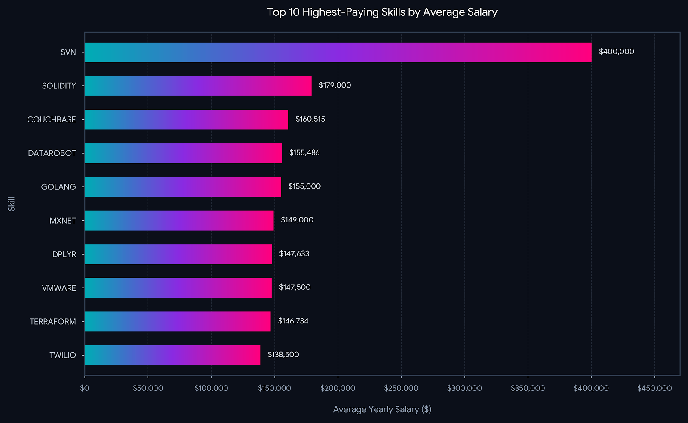
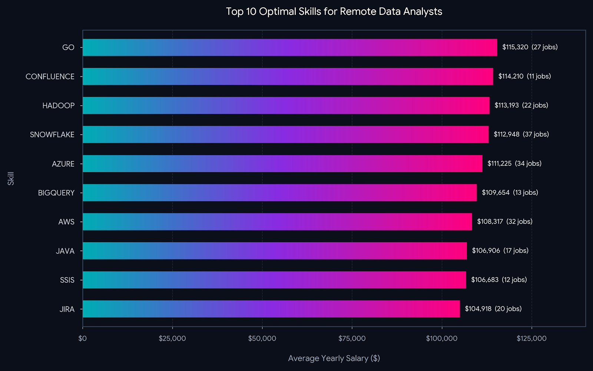

# 📊 Data Analyst Job Market & Salary Analysis (2023)

## 📌 Introduction
This project explores the global and remote job market landscape for **Data Analysts in 2023**. By analyzing thousands of job postings, salary data, and skill requirements, this project uncovers the most in-demand skills, the highest-paying technical proficiencies, and the optimal skill set that balances job market demand with lucrative compensation.
SQL queries? Check them here: [pro_sql folder](/pro_sql/)

---

## 🔍 Background
Driven by a desire to optimize career growth in data analytics, this project addresses key questions:
1. **What are the absolute top-paying Data Analyst roles and companies?**
2. **What technical skills are non-negotiable across general job postings?**
3. **Which niche skills offer the highest compensation premiums?**
4. **What is the intersection of high demand and high salary for remote data analysts?**

---

## 🛠️ Tools I Used
- **SQL (PostgreSQL):** Advanced data extraction, multi-table joins, subqueries, and Common Table Expressions (CTEs) to clean, filter, and aggregate salary and skill metrics.
- **Python (Pandas, NumPy):** Data manipulation, statistical summaries, and categorical clustering.
- **Data Visualization (Matplotlib, Seaborn):** Crafting publication-ready bar charts, dual-axis rankings, and demand-vs-salary scatter plots.
- **Git & GitHub:** Version control, workflow management, and documentation.

---

## 📈 The Analysis

### 1. Top-Paying Data Analyst Roles
- The highest-paying roles reach up to **$650,000**, with top-tier leadership and principal positions (**Director of Analytics**, **Associate Director - Data Insights**, **Principal Data Analyst**) clustering between **$184,000 and $336,500**.
- Top employers include tech leaders and enterprise firms such as **Meta, AT&T, Pinterest, Motional, SmartAsset, and UCLA Health**.
- High compensation strongly favors full remote/hybrid flexibility ("Work from Anywhere").
#### SQL Representation below :- ####
```sql
SELECT
    job_id,
    job_title,
    job_location,
    job_schedule_type,
    salary_year_avg,
    job_posted_date,
    name as company_name
FROM
    job_postings_fact
LEFT JOIN company_dim on job_postings_fact.company_id = company_dim.company_id
WHERE
    job_title_short = 'Data Analyst' AND 
    job_location = 'Anywhere' AND
    salary_year_avg is not NULL
ORDER BY
    salary_year_avg DESC
LIMIT 10; 
```

*Bar graph visualizing the salary for the top 10
salaries for data analysts; Gemini generated this
graph from my SQL query results*


### 2. skills for top paying jobs in Data Analysis ###
Across all data analyst postings, foundational data tools dominate:
1. **SQL (92,628 postings / ~30.6% share)** – The uncontested baseline requirement.
2. **Excel (67,031 postings / ~22.1% share)** – The standard for business reporting and ad-hoc analysis.
3. **Python (57,326 postings / ~18.9% share)** – The industry-standard programming and scripting language.
4. **Tableau (46,554 postings)** & **Power BI (39,468 postings)** – Visual storytelling anchors.
#### SQL Reprsentation below :- ####
```sql
with top_paying_jobs as (
    SELECT
        job_id,
        job_title,
        salary_year_avg,
        name as company_name
    FROM
        job_postings_fact
    LEFT JOIN company_dim on job_postings_fact.company_id = company_dim.company_id
    WHERE
        job_title_short = 'Data Analyst' AND 
        job_location = 'Anywhere' AND
        salary_year_avg is not NULL
    ORDER BY
        salary_year_avg DESC
)

SELECT 
    top_paying_jobs.*,
    skills
from top_paying_jobs
INNER JOIN skills_job_dim on top_paying_jobs.job_id = skills_job_dim.job_id
INNER JOIN skills_dim on skills_job_dim.skill_id = skills_dim.skill_id
ORDER BY
    salary_year_avg DESC
```


*Bar graph visualizing for the top 10
most demanded skills in Top paying Data Analysts Job; Gemini generated this
graph from my SQL query results*


# 3. Top Data Analyst Skills by Demand

An overview of the top 5 most demanded skills in Data Analyst job postings[cite: 2].

| Rank | Skill | Job Postings | Share |
| :---: | :--- | :---: | :---: |
| 1 | **SQL** | 92,628 | 30.6% |
| 2 | **Excel** | 67,031 | 22.1% |
| 3 | **Python** | 57,326 | 18.9% |
| 4 | **Tableau** | 46,554 | 15.4% |
| 5 | **Power BI** | 39,468 | 13.0% |

## 🔍 Key Takeaways
* **SQL is #1:** Appears in nearly 1 in 3 postings as the primary baseline[cite: 2].
* **Top 3 Core:** SQL, Excel, and Python drive **71.6%** of total demand[cite: 2].
* **BI Split:** Tableau maintains an 18% lead over Power BI[cite: 2].

## 🎯 Target Stack
`SQL` ➔ `Excel` ➔ `Python` ➔ `Tableau / Power BI`
#### SQL Reprsentation below :- ####
```sql
SELECT 
    skills,
    count(skills_job_dim.job_id) as demand_count
from job_postings_fact
INNER JOIN skills_job_dim on job_postings_fact.job_id = skills_job_dim.job_id
INNER JOIN skills_dim on skills_job_dim.skill_id = skills_dim.skill_id
WHERE
    job_title_short = 'Data Analyst'
GROUP BY
    skills
ORDER BY
    demand_count DESC
LIMIT 5; 
```

*Bar graph visualizing for the top 5
most demanded skills in  Data Analysts Job; Gemini generated this
graph from my SQL query results*

### 4. Optimal Sweet Spot (High Demand + High Pay in Remote Roles)
When cross-referencing salary against market volume for remote Data Analyst roles:
- **Core Volume Anchors:** **Python** (236 postings, $101.4k avg), **Tableau** (230 postings, $99.3k avg), and **R** (148 postings, $100.5k avg).
- **High-Value Cloud/BI Upgrades:** **Looker** ($103.8k), **Snowflake** ($112.9k), and **Azure** ($111.2k) offer the strongest balance between solid hiring demand and elevated pay tiers.
#### SQL Reprsentation below :- ####
```sql
SELECT 
    skills,
    ROUND(AVG(salary_year_avg),0) as avg_salary
from job_postings_fact
INNER JOIN skills_job_dim on job_postings_fact.job_id = skills_job_dim.job_id
INNER JOIN skills_dim on skills_job_dim.skill_id = skills_dim.skill_id
WHERE
    job_title_short = 'Data Analyst' AND
    salary_year_avg is not NULL
 -- AND job_work_from_home = True
GROUP BY
    skills
ORDER BY
    avg_salary DESC
LIMIT 25;
```

*Bar graph visualizing for the top 10
most paying jobs; Gemini generated this
graph from my SQL query results*

---


## 5. Top 10 optimal-Skills Ranking

| Rank | Skill | Average Salary ($) | Job Demand | Strategic Domain |
| :---: | :--- | :---: | :---: | :--- |
| **1** | **Go** | $115,320 | 27 | Systems & Backend Programming |
| **2** | **Confluence** | $114,210 | 11 | Agile Collaboration & Documentation |
| **3** | **Hadoop** | $113,193 | 22 | Big Data Processing |
| **4** | **Snowflake** | $112,948 | 37 | Cloud Data Warehousing |
| **5** | **Azure** | $111,225 | 34 | Cloud Platform & Services |
| **6** | **BigQuery** | $109,654 | 13 | Serverless Data Warehousing |
| **7** | **AWS** | $108,317 | 32 | Cloud Infrastructure & Pipelines |
| **8** | **Java** | $106,906 | 17 | Enterprise Application Development |
| **9** | **SSIS** | $106,683 | 12 | Enterprise ETL / Integration |
| **10** | **Jira** | $104,918 | 20 | Project Management & Agile Tracking |

---

## 🔍 Key Insights

* **High Earning Baseline:** Every skill in the top 10 averages above **$104,000**, with the top 5 clearing the **$111,000+** threshold[cite: 5].
* **Cloud & Warehouse Sweet Spot:** **Snowflake** (37 postings, $112,948), **Azure** (34 postings, $111,225), and **AWS** (32 postings, $108,317) offer the best combination of six-figure pay and high hiring volume[cite: 5].
* **Engineering Overlap:** High-performance languages and pipeline infrastructure (**Go**, **Hadoop**, **Java**) command the top salary bracket[cite: 5].
#### SQL Reprsentation below :- ####
```sql
SELECT
    skills_dim.skill_id,
    skills_dim.skills,
    COUNT(skills_job_dim.job_id) AS demand_count,
    ROUND(AVG(salary_year_avg), 0) AS average_salary
FROM job_postings_fact
INNER JOIN skills_job_dim on job_postings_fact.job_id = skills_job_dim.job_id
INNER JOIN skills_dim on skills_job_dim.skill_id = skills_dim.skill_id
WHERE
    job_title_short = 'Data Analyst'
    AND salary_year_avg IS NOT NULL
    AND job_work_from_home = True
GROUP BY
    skills_dim.skill_id
HAVING
    COUNT(skills_job_dim.job_id) > 10
ORDER BY
    average_salary DESC,
    demand_count DESC
LIMIT 10;
 ```
 
 *Bar graph visualizing for the top 10
optimal skills to learn; Gemini generated this
graph from my SQL query results*

## 🧠 What I Learned
- **SQL is Non-Negotiable:** Regardless of salary tier or company size, SQL remains the single most universally tested and demanded skill.
- **The Modern Cloud Premium:** Transitioning from traditional on-prem/spreadsheet workflows to cloud-native data warehouses (**Snowflake, BigQuery, AWS/Azure**) directly translates into higher salary tiers.
- **Engineering Convergence:** Data analysts who adopt software engineering and workflow automation practices (**Git, Airflow, CI/CD, Python**) earn significantly more than traditional dashboard-only analysts.
- **SQL Query Optimization:** Mastered CTE chaining, multi-level aggregations, and query optimization techniques to analyze complex relational datasets efficiently.

---

## 🎯 Conclusion
To maximize career trajectory and earning potential in modern data analytics:
1. **Master the Foundation:** Establish strong proficiency in **SQL, Python, and Tableau/Power BI**.
2. **Upskill into Cloud Warehousing:** Add **Snowflake, BigQuery, or AWS/Azure** to bridge into high-paying analytics engineering domains.
3. **Adopt Software Hygiene:** Implement **Git, workflow automation, and structured data pipelines** to stand out in competitive remote global markets.
