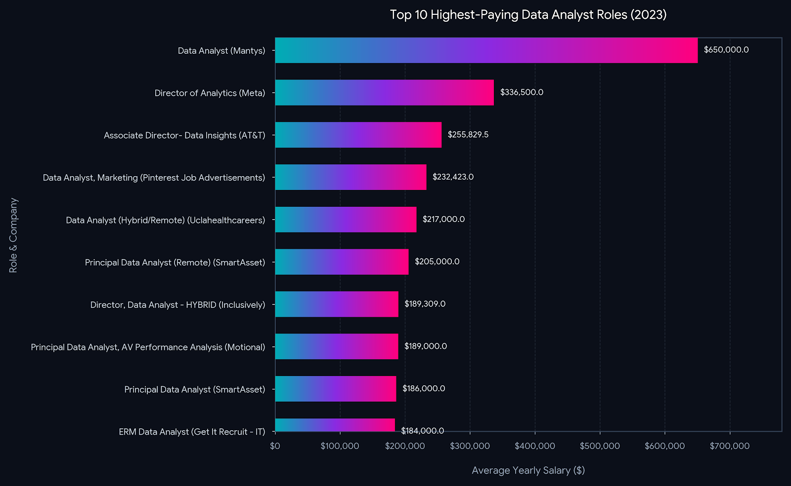

# 📊 Data Analyst Job Market & Salary Analysis (2023)

## 📌 Introduction
This project explores the global and remote job market landscape for **Data Analysts in 2023**. By analyzing thousands of job postings, salary data, and skill requirements, this project uncovers the most in-demand skills, the highest-paying technical proficiencies, and the optimal skill set that balances job market demand with lucrative compensation.
SQL queries? Check them here: [pro_sql folder](/pro_sql/)

---

## 🔍 Background
Driven by a desire to optimize career growth in data analytics, this project addresses key questions:
1. **What are the absolute top-paying Data Analyst roles and companies?**
2. **What technical skills are non-negotiable across general job postings?**
3. **Which niche skills offer the highest compensation premiums?**
4. **What is the intersection of high demand and high salary for remote data analysts?**

---

## 🛠️ Tools I Used
- **SQL (PostgreSQL):** Advanced data extraction, multi-table joins, subqueries, and Common Table Expressions (CTEs) to clean, filter, and aggregate salary and skill metrics.
- **Python (Pandas, NumPy):** Data manipulation, statistical summaries, and categorical clustering.
- **Data Visualization (Matplotlib, Seaborn):** Crafting publication-ready bar charts, dual-axis rankings, and demand-vs-salary scatter plots.
- **Git & GitHub:** Version control, workflow management, and documentation.

---

## 📈 The Analysis

### 1. Top-Paying Data Analyst Roles
- The highest-paying roles reach up to **$650,000**, with top-tier leadership and principal positions (**Director of Analytics**, **Associate Director - Data Insights**, **Principal Data Analyst**) clustering between **$184,000 and $336,500**.
- Top employers include tech leaders and enterprise firms such as **Meta, AT&T, Pinterest, Motional, SmartAsset, and UCLA Health**.
- High compensation strongly favors full remote/hybrid flexibility ("Work from Anywhere").
#### SQL Representation below :- ####
```sql
SELECT
    job_id,
    job_title,
    job_location,
    job_schedule_type,
    salary_year_avg,
    job_posted_date,
    name as company_name
FROM
    job_postings_fact
LEFT JOIN company_dim on job_postings_fact.company_id = company_dim.company_id
WHERE
    job_title_short = 'Data Analyst' AND 
    job_location = 'Anywhere' AND
    salary_year_avg is not NULL
ORDER BY
    salary_year_avg DESC
LIMIT 10; 
```



### 2. Most In-Demand Skills Overall
Across all data analyst postings, foundational data tools dominate:
1. **SQL (92,628 postings / ~30.6% share)** – The uncontested baseline requirement.
2. **Excel (67,031 postings / ~22.1% share)** – The standard for business reporting and ad-hoc analysis.
3. **Python (57,326 postings / ~18.9% share)** – The industry-standard programming and scripting language.
4. **Tableau (46,554 postings)** & **Power BI (39,468 postings)** – Visual storytelling anchors.

### 3. Highest-Paying Skills
- **Niche & Web3/Specialized Databases:** Skills such as **Solidity ($179k)**, **Couchbase ($160.5k)**, and **DataRobot ($155.5k)** command major salary premiums due to talent scarcity.
- **Cloud & Modern Data Stack:** Technologies like **Snowflake ($112.9k)**, **Azure ($111.2k)**, **BigQuery ($109.7k)**, and **AWS ($108.3k)** offer a ~$10k–$15k salary boost over traditional spreadsheet-only profiles.
- **AI & ML Frameworks:** Deep learning tools (**MXNet, Keras, PyTorch, Hugging Face, TensorFlow**) average between **$120k and $149k**.

### 4. Optimal Sweet Spot (High Demand + High Pay in Remote Roles)
When cross-referencing salary against market volume for remote Data Analyst roles:
- **Core Volume Anchors:** **Python** (236 postings, $101.4k avg), **Tableau** (230 postings, $99.3k avg), and **R** (148 postings, $100.5k avg).
- **High-Value Cloud/BI Upgrades:** **Looker** ($103.8k), **Snowflake** ($112.9k), and **Azure** ($111.2k) offer the strongest balance between solid hiring demand and elevated pay tiers.

---

## 🧠 What I Learned
- **SQL is Non-Negotiable:** Regardless of salary tier or company size, SQL remains the single most universally tested and demanded skill.
- **The Modern Cloud Premium:** Transitioning from traditional on-prem/spreadsheet workflows to cloud-native data warehouses (**Snowflake, BigQuery, AWS/Azure**) directly translates into higher salary tiers.
- **Engineering Convergence:** Data analysts who adopt software engineering and workflow automation practices (**Git, Airflow, CI/CD, Python**) earn significantly more than traditional dashboard-only analysts.
- **SQL Query Optimization:** Mastered CTE chaining, multi-level aggregations, and query optimization techniques to analyze complex relational datasets efficiently.

---

## 🎯 Conclusion
To maximize career trajectory and earning potential in modern data analytics:
1. **Master the Foundation:** Establish strong proficiency in **SQL, Python, and Tableau/Power BI**.
2. **Upskill into Cloud Warehousing:** Add **Snowflake, BigQuery, or AWS/Azure** to bridge into high-paying analytics engineering domains.
3. **Adopt Software Hygiene:** Implement **Git, workflow automation, and structured data pipelines** to stand out in competitive remote global markets.
